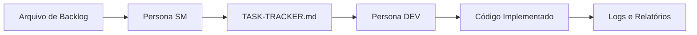

# Agent Orchestrator - Orquestrador de Agentes de IA

## 🎯 Visão Geral

O **Agent Orchestrator** é uma ferramenta open source que automatiza o processo de desenvolvimento de software através da orquestração inteligente de agentes de IA (Claude Code e Gemini CLI). O produto transforma backlogs de produto em sprints executáveis, gerenciando todo o pipeline de desenvolvimento de forma automatizada.

### Proposta de Valor
- **Redução de 70%** no tempo de planejamento de sprints
- **Automatização completa** do pipeline de desenvolvimento
- **Integração híbrida** de múltiplos agentes de IA
- **Flexibilidade total** para diferentes tipos de projeto
- **Código 100% open source** e extensível

## 📚 Documentação Completa

Este projeto inclui documentação completa seguindo o fluxo de negócio e produto:

### 📋 Contexto dos Agentes
- **[claude.md](claude.md)** - Contexto completo do Claude Code
- **[gemini.md](gemini.md)** - Contexto completo do Gemini CLI

### 🏢 Documentação de Negócio
- **[docs/product/business_analysis.md](docs/product/business_analysis.md)** - Análise de negócio completa
- **[docs/product/product_management.md](docs/product/product_management.md)** - Gestão de produto e roadmap
- **[docs/product/product_ownership.md](docs/product/product_ownership.md)** - Backlog detalhado e user stories
- **[docs/product/scrum_master.md](docs/product/scrum_master.md)** - Metodologia Scrum e processos
- **[docs/product/architecture.md](docs/product/architecture.md)** - Arquitetura técnica e decisões

## 🚀 Como Funciona

### Fluxo de Trabalho


### Comandos Principais
```bash
# Análise de backlog
agent_orchestrator analyze backlog.md

# Geração de sprint
agent_orchestrator sprint backlog.md --max-points 30

# Execução de tarefa única
agent_orchestrator execute TASK-001

# Execução de sprint completo
agent_orchestrator sprint SPRINT-001

# Execução de backlog completo
agent_orchestrator backlog BACKLOG.md
```

## 🎯 Características Principais

### Orquestração Inteligente
- **Claude Code**: Análise profunda, planejamento, documentação
- **Gemini CLI**: Execução rápida, prototipagem, validação
- **Decisão Automática**: Sistema escolhe o agente ideal
- **Fallback**: Se um falhar, outro assume

### Flexibilidade Total
- **Qualquer Projeto**: Adaptável a diferentes tecnologias
- **Qualquer Backlog**: Suporte a múltiplos formatos
- **Qualquer Escala**: De tarefas únicas a projetos completos
- **Qualquer Configuração**: Templates e configurações customizáveis

### Automação Completa
- **Análise**: Leitura e parsing automático de backlogs
- **Planejamento**: Geração automática de sprints
- **Execução**: Implementação automática de tarefas
- **Validação**: Testes e qualidade automáticos
- **Documentação**: Geração automática de documentação

## 📊 Métricas de Sucesso

### Produto
- **Taxa de Sucesso**: > 95% das tarefas executadas
- **Tempo de Execução**: < 30s para tarefas simples
- **Qualidade**: > 80% cobertura de testes
- **Performance**: < 100ms para comandos básicos

### Negócio
- **Downloads**: 1.000+ instalações via pip
- **Stars**: 100+ no GitHub
- **Comunidade**: 10+ contribuições
- **Satisfação**: NPS > 50

## 🏗️ Arquitetura

### Componentes Principais
- **CLI Interface**: Interface de linha de comando
- **Core Engine**: Orquestração e coordenação
- **Agent Manager**: Gerenciamento de agentes
- **I/O Layer**: Entrada/saída de dados

### Padrões de Design
- **Command Pattern**: Para comandos CLI
- **Factory Pattern**: Para criação de agentes
- **Strategy Pattern**: Para orquestração
- **Repository Pattern**: Para I/O

### Tecnologias
- **Python 3.10**: Linguagem principal
- **Pydantic**: Validação de dados
- **Black**: Formatação de código
- **pytest**: Framework de testes

## 📋 Roadmap

### Fase 1: MVP (Meses 1-3)
- ✅ Orquestração básica
- ✅ Análise de backlog
- ✅ Geração de sprint
- ✅ Execução de tarefas
- ✅ Logs e relatórios

### Fase 2: Crescimento (Meses 4-9)
- 🔄 Templates avançados
- 🔄 Integrações (GitHub, Jira)
- 🔄 Dashboard web
- 🔄 Configuração avançada
- 🔄 Sistema de plugins

### Fase 3: Escala (Meses 10-18)
- 📅 CI/CD integration
- 📅 Multi-project support
- 📅 Analytics avançados
- 📅 Enterprise features
- 📅 Mobile support

### Fase 4: Dominância (Meses 19-36)
- 🚀 AI Agents marketplace
- 🚀 Cross-platform
- 🚀 Cloud services
- 🚀 API pública
- 🚀 Machine learning

## 🎯 Casos de Uso

### Desenvolvedor Individual
```bash
# Automatizar tarefas repetitivas
agent_orchestrator execute TASK-001

# Focar em lógica de negócio
agent_orchestrator analyze backlog.md
```

### Tech Lead
```bash
# Padronizar processos
agent_orchestrator sprint SPRINT-001

# Aumentar produtividade da equipe
agent_orchestrator backlog BACKLOG.md
```

### Product Owner
```bash
# Entregar valor rapidamente
agent_orchestrator analyze backlog.md

# Manter backlog organizado
agent_orchestrator sprint BACKLOG.md --max-points 30
```

## 🔧 Instalação e Configuração

### Pré-requisitos
```bash
# Python 3.10+
python --version

# Claude Code
npm install -g @anthropic-ai/claude-code

# Gemini CLI
npm install -g @google/gemini-cli

# BMAD-METHOD
git clone https://github.com/bmadcode/BMAD-METHOD.git
cd BMAD-METHOD
./install.sh --full
```

### Instalação
```bash
# Via pip
pip install agent-orchestrator

# Via source
git clone https://github.com/seu-repo/agent-orchestrator.git
cd agent-orchestrator
pip install -e .
```

### Configuração
```bash
# Configurar API keys
export ANTHROPIC_API_KEY="sua-chave-claude"
export GOOGLE_API_KEY="sua-chave-gemini"

# Verificar instalação
agent_orchestrator --help
```

## 📖 Exemplos de Uso

### Exemplo 1: Projeto Novo
```bash
# 1. Criar backlog
cat > backlog.md << EOF
# Backlog - Sistema de Blog

### TASK-001: Criar posts
Como autor, quero criar posts para compartilhar conteúdo
Pontos: 5
Prioridade: P1

### TASK-002: Comentários em posts  
Como leitor, quero comentar em posts para interagir
Pontos: 3
Prioridade: P2
EOF

# 2. Executar orquestrador
agent_orchestrator backlog backlog.md --max-points 8

# 3. Verificar resultados
ls output/
cat output/TASK-TRACKER.md
```

### Exemplo 2: Sprint Específico
```bash
# Executar sprint específico
agent_orchestrator sprint SPRINT-001

# Ver progresso
agent_orchestrator status
```

### Exemplo 3: Tarefa Única
```bash
# Executar tarefa específica
agent_orchestrator execute TASK-001

# Ver resultado
cat output/task_TASK-001_result.md
```

## 🚨 Considerações Importantes

### Segurança
- **API Keys**: Armazenamento seguro de credenciais
- **Validação**: Sempre revisar código gerado
- **Ambiente**: Usar em desenvolvimento/teste
- **Backup**: Manter versões anteriores

### Limitações
- **Dependência de APIs**: Requer conexão com serviços externos
- **Custos**: Uso de tokens pode gerar custos
- **Validação Humana**: Requer revisão de código gerado
- **Complexidade**: Curva de aprendizado inicial

## 🤝 Contribuição

### Como Contribuir
1. **Fork** o repositório
2. **Crie** uma branch para sua feature
3. **Implemente** suas mudanças
4. **Teste** suas mudanças
5. **Submeta** um pull request

### Padrões de Código
- **Python 3.10**: Versão mínima
- **Black**: Formatação automática
- **flake8**: Linting
- **mypy**: Type checking
- **pytest**: Testes

### Documentação
- **Docstrings**: 100% das funções documentadas
- **Type Hints**: 100% das funções tipadas
- **README**: Atualizado com mudanças
- **CHANGELOG**: Histórico de mudanças

## 📞 Suporte

### Recursos
- **[Documentação](docs/)**: Guias detalhados
- **[Issues](https://github.com/seu-repo/agent-orchestrator/issues)**: Reportar problemas
- **[Discussions](https://github.com/seu-repo/agent-orchestrator/discussions)**: Discussões da comunidade
- **[Wiki](https://github.com/seu-repo/agent-orchestrator/wiki)**: Conhecimento compartilhado

### Comunidade
- **Slack**: Canal #agent-orchestrator
- **Discord**: Servidor da comunidade
- **Meetups**: Eventos presenciais
- **Conferências**: Apresentações em eventos

## 📄 Licença

Este projeto está licenciado sob a **MIT License** - veja o arquivo [LICENSE](LICENSE) para detalhes.

## 🙏 Agradecimentos

- **Anthropic**: Pelo Claude Code
- **Google**: Pelo Gemini CLI
- **BMAD-METHOD**: Pela metodologia
- **Comunidade**: Por todas as contribuições

---

**Agent Orchestrator** - Transformando desenvolvimento de software através da orquestração inteligente de agentes de IA. 